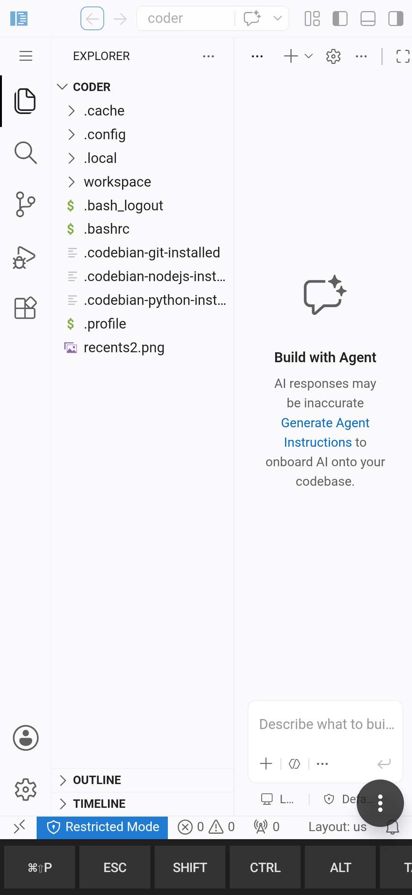
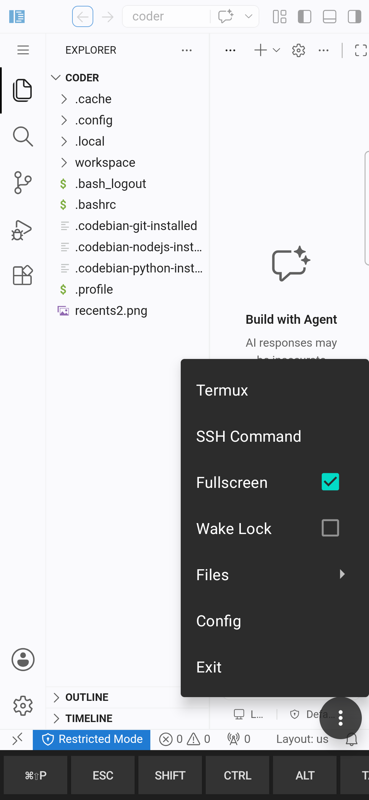
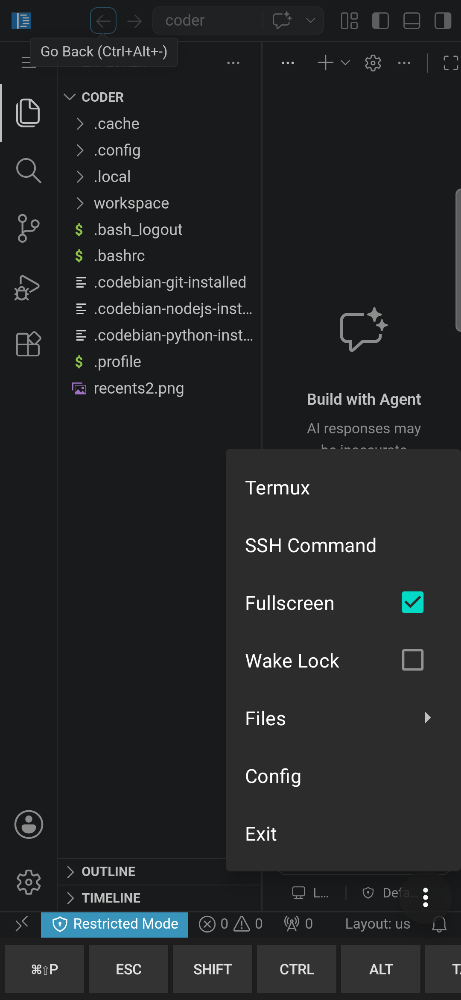
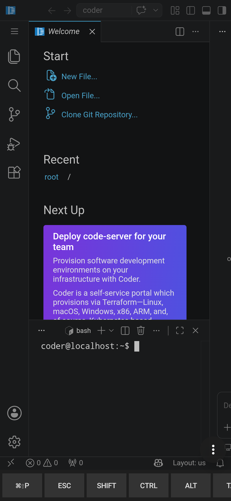
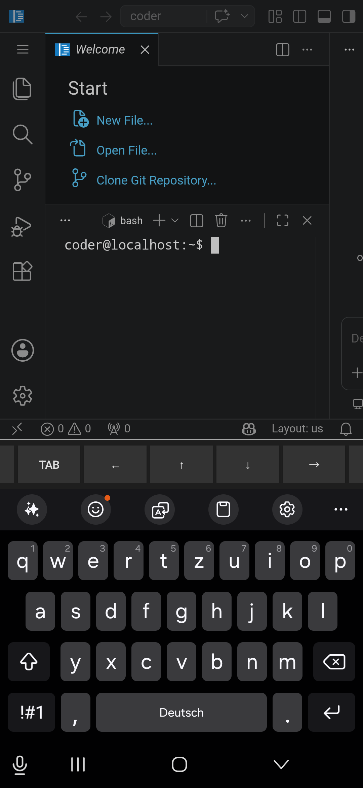
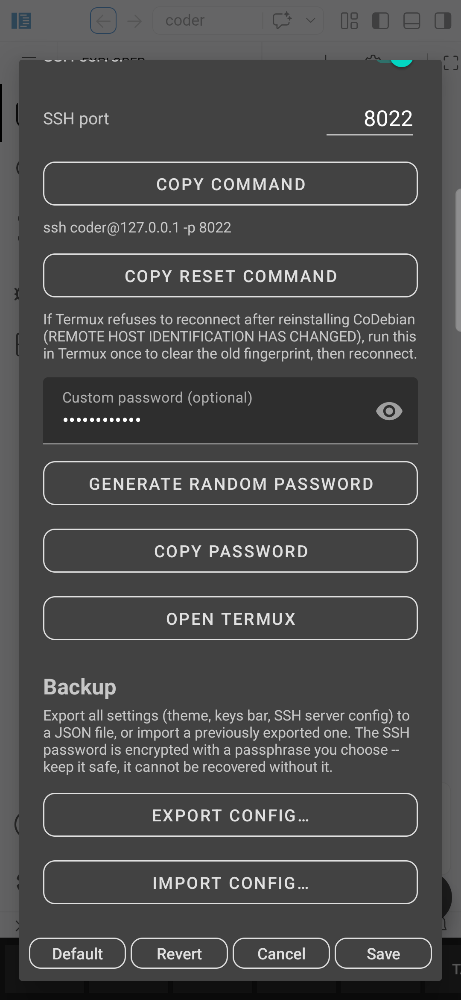

# CoDebian

A self-contained Android app that runs a Debian rootfs + [code-server](https://github.com/coder/code-server)
entirely inside its own process, and shows it in its own `WebView` with a
proper on-screen special-keys row (Ctrl/Alt/Esc/Tab/arrows).

<p float="left">
  
  
  
  
  
  
</p>

## Note
This project still is a proof of concept (PoC) with the typical limitations of running code-server on Android. Nevertheless I have tried to make it as convenient as possible for usage on mobile Android devices.

## Features

- **code-server in an app-owned `WebView`** -- no VNC/X11 in the loop, no
  system-browser chrome intercepting keys (see "Why this exists" below).
- **On-screen special-keys row** (`ExtraKeysBar.kt`): Ctrl/Alt/Shift (sticky
  toggles), Esc, Tab, Cmd/⇧P, and arrow keys, synthesized as real DOM
  `KeyboardEvent`s via `KeyBridge.kt` so code-server's own keybindings (which
  a generic mobile browser tab can't reliably deliver) work correctly.
  Configurable **height** (5 presets) and **key width** (0.25x-1.00x) from
  the Settings dialog.
- **Floating quick-actions menu** (long-press or tap the draggable FAB):
  - Open Termux directly
  - Copy the ready-to-paste SSH command
  - Toggle Fullscreen / Wake Lock immediately (no Save step)
  - **Files submenu**: Pick Workspace Folder…,
    Sync Workspace Back (see Storage section below)
  - Config (opens the full Settings dialog)
  - **Exit**, with a confirmation dialog (default: Cancel) that stops all
    running server processes (code-server, sshd) before closing the app
- **Persistent foreground-service notification** (small monochrome CoDebian
  icon, correct even when collapsed) mirrors the same **Exit** and **Wake
  Lock toggle** actions as the floating menu, so both are reachable without
  reopening the app -- same behavior Termux offers.
- **Consolidated Settings dialog** (Default / Revert / Cancel / Save, with a
  live-preview-then-commit behavior model) covering:
  - **Display**: Theme (Dark/Light/System, each with an optional
    Material-You "wallpaper" variant on Android 12+) and Fullscreen
  - **Keys Bar**: show/hide, height, key width
  - **Remote Access**: tabbed "SSH / SFTP", "MCP", and "Code Server"
    sections. **SSH / SFTP**: enable switch, separate SSH and SFTP ports
    (defaults 8022/8023 -- one `sshd` process listening on both, since SFTP
    is just its `Subsystem sftp` subsystem, sharing the same account/password
    as plain SSH), one-tap copy of the SSH and SFTP commands, a random or
    custom password (encrypted at rest via Android Keystore) that's applied
    immediately even while sshd is already running, and a **"Copy reset
    command"** button that copies `ssh-keygen -R "[127.0.0.1]:<port>"` --
    fixes Termux's "REMOTE HOST IDENTIFICATION HAS CHANGED" error after a
    CoDebian reinstall regenerates the SSH host keys. **Code Server**: the
    in-app editor's own port (default 8080, matching code-server's own
    convention) and an optional password (off/`--auth none` by default,
    since the WebView is already the only client that can reach it);
    changing either restarts code-server and reloads the WebView at the new
    port, with a brief "Applying code-server settings…" overlay instead of a
    raw connection-refused flash.
  - **Backup**: **Export/Import all settings** to/from a JSON file via SAF.
    The SSH/MCP/code-server secrets are encrypted with a passphrase you
    choose (PBKDF2 -> AES-256-GCM), so the backup is portable across
    devices/reinstalls without relying on the device-bound Android Keystore
  - **Environment**: bundled tools (git, Node.js LTS, Python 3) and an
    "Update code-server" button (code-server has no apt repo, so it's
    installed from its latest GitHub release)
- **Storage Access Framework (SAF) file features** -- deliberately not
  `MANAGE_EXTERNAL_STORAGE` (high Play Store rejection risk for an app like
  this):
  - **Pick Workspace Folder**: link any SAF folder as `~/workspace` inside
    the rootfs (one-time copy-in)
  - **Sync Workspace Back**: copy `~/workspace` back out to the linked SAF
    folder on demand (new/changed files included)
- **File Exposure + MCP filesystem server** -- a shared, consolidated
  exposure model:
  - Toggle which sources are exposed: rootfs home directory, the linked SAF
    workspace, and/or an app-owned "shared" folder, each independently, plus
    optional include/exclude glob patterns (materialized via hard links) and
    a manual "Refresh Exposure" button.
  - **MCP filesystem server** (`@modelcontextprotocol/server-filesystem`
    behind `mcp-proxy`, loopback-only, default port 3900): enable/port
    toggle, one-tap copy of the server URL, a random or custom API key
    (encrypted at rest) -- lets any MCP-compatible AI client read/write the
    exposed folders.
- **Wake lock toggle**: holds a partial wake lock while the bootstrap/server
  foreground service runs, so code-server/sshd keep responding with the
  screen off.
- **Bootstrap progress reporting**: first-run setup shows per-step progress
  (container extraction, code-server, git, Node.js LTS, Python) instead of a
  single opaque spinner.
- **Explicit first-run consent screen** before any download/exec happens
  (see Play Store compliance below).

## Why this exists

Earlier approaches (see the sibling `codebian-installer` and
`proot-distro-debian-termux-x11` projects) ran into three separate problems:

1. **VNC to a full XFCE + VS Code desktop** hangs or shows only the window
   frame. This app skips X11/VNC entirely -- code-server is headless, so
   there's no display protocol in the loop at all.
2. **code-server needs proper special-key handling.** A generic mobile
   browser tab can't be trusted to deliver Ctrl/Alt/Esc/Tab (browser chrome
   intercepts them for its own UI). Because code-server is shown in *our
   own* `WebView` here -- not system Chrome -- `MainActivity` fully owns
   `dispatchKeyEvent` and synthesizes the equivalent DOM `KeyboardEvent`s
   itself (see `KeyBridge.kt`), plus a Termux-style on-screen extra-keys row
   (`ExtraKeysBar.kt`) with sticky Ctrl/Alt/Shift toggles for touch-only use.
3. **Termux refuses programmatic `RUN_COMMAND`s** for the current
   `codebian-installer` setup. This app doesn't depend on the separately
   installed Termux app at all: it bundles its own `proot` binary (shipped
   as a renamed `lib*.so` under `jniLibs/`, since Android 10+ only allows
   exec from `nativeLibraryDir`) and drives it directly from a foreground
   `Service` -- see `ProotRuntime.kt` / `BootstrapService.kt`. No external
   app, no `allow-external-apps` gate, no intent-based sandbox boundary.

## Architecture

```
MainActivity (WebView, always-visible extra-keys row)
     |
     |  observes
     v
BootstrapManager (StateFlow<BootstrapState>)
     ^
     | updates
     |
BootstrapService (foreground Service)
     |  1. download Debian rootfs tarball (first run only)
     |  2. extract with commons-compress (pure Java, no native dep)
     |  3. proot -0 -r <rootfs> ... apt-get install code-server
     |  4. proot -0 -r <rootfs> ... code-server --bind-addr 127.0.0.1:8080
     v
ProotRuntime (execs the bundled proot binary against the rootfs)
```

## Current status

- Debian rootfs is pinned to **trixie** (current stable) via the Docker
  Registry v2 API against `registry-1.docker.io` -- see `RemoteAssets.kt` /
  `DockerRegistryClient.kt`. Downloaded blobs are SHA-256 verified against
  the registry-declared digest before extraction.
- `app/src/main/jniLibs/arm64-v8a/` is populated with a real `proot` binary
  + loader helpers, fetched via `scripts/fetch-assets.ps1` from Termux's own
  `.deb` (already proven to work under Android's SELinux policy).
- No code-signing / release config yet; debug build only.
- **Verified end-to-end on a real device** (Samsung Galaxy S25+, One UI):
  bootstrap, code-server editing with special keys, SSH/SFTP server, SAF
  file import/export/workspace sync, and Settings backup/restore have all
  been build-installed and exercised on-device.

## Google Play Store compliance

CoDebian's core mechanism -- downloading a Debian rootfs and executing
binaries inside it via `proot` -- sits in the same category as Termux and
UserLAnd, both of which are live on Play today. Google's literal Developer
Program Policy text on "unauthorized code execution" has no explicit
carve-out for this category; in practice Play tolerates it for transparent,
user-directed Linux-environment/dev-tool apps, reviewed with some
discretion rather than a documented exception. There is **no guarantee of
approval**, and Termux's own relaunch took significant restructuring and
roughly 1.5 years of iteration. Steps taken so far to align with the
pattern that has worked for others:

1. **Explicit first-run consent screen** (`MainActivity.showConsentDialog`,
   gated on a `SharedPreferences` flag) -- the bootstrap download/exec never
   starts silently on launch; the user must tap "Set Up Linux Environment"
   first, after seeing exactly what will be downloaded and run.
2. **SHA-256 verification** of the downloaded rootfs blob against the
   registry-declared digest before extraction (`DockerRegistryClient.verifyDigest`),
   aborting rather than extracting/executing unverified content.
3. **Minimal permissions**: only `INTERNET`, `POST_NOTIFICATIONS`,
   `FOREGROUND_SERVICE` + `FOREGROUND_SERVICE_SPECIAL_USE`. No cross-app
   `RUN_COMMAND`-style intents (the thing Termux had to remove for its Play
   build) since CoDebian has no external-app dependency to begin with.
   `targetSdk` tracks the latest stable API (currently 35).
4. **`proot` ships as a renamed `lib*.so` under `jniLibs/`** (this repo's
   existing approach, see `ProotRuntime.kt`) rather than the riskier
   `system_linker_exec` bypass Termux's Play build reportedly uses -- a
   single interpreter binary shipped as a proper native lib is a cleaner,
   lower-risk fit for how Play expects "engine" binaries to be distributed
   (comparable to how browsers ship their own JS/WASM engines as native
   libs and only download *data* interpreted by them).
5. **Framing**: downloaded rootfs content only ever affects the user's own
   sandboxed Debian environment, never CoDebian's own app code/behavior --
   this is the actual distinction Play's anti-tampering policy cares about,
   and should be reflected in the Play Console store listing (category:
   Developer Tools) and Data Safety form (no user data collected; network
   access used only to fetch the Debian image and code-server's own
   dependencies inside the sandbox).

### Suggested Play Console text

**Foreground service `specialUse` declaration** (already set as the
manifest property, reuse verbatim in the Play Console form):
> Runs a local proot Debian rootfs + code-server for the in-app editor, so
> the user's coding session keeps running while the app is backgrounded.

**Data Safety / store listing summary**:
> CoDebian downloads a standard Debian Linux image and runs it in an
> unprivileged, app-sandboxed container (no root) to provide a full Linux
> development environment and the code-server editor, entirely on-device.
> No data is collected or leaves the device beyond what the user's own code
> and tools do; there is no analytics or ad SDK.

### Still recommended before a public Play launch

- Submit first to a **closed testing track** to get real reviewer signal
  before wider release.
- Keep a non-Play distribution channel ready (direct APK / GitHub Releases)
  as a fallback, since approval isn't guaranteed even with the above.
- **16 KB page size alignment** (Play requirement for all `targetSdk 35+`
  submissions since November 2025): 4 of the 5 bundled native libraries
  (`libproot.so`, `libproot-loader.so`, `libtalloc.so`,
  `libandroid-shmem.so`) are already 16 KB-aligned in the upstream Termux
  build fetched by `scripts/fetch-assets.ps1`. **`libproot-loader32.so`
  (the 32-bit ARM helper) is only 4 KB-aligned** and would likely be flagged
  by Play's automated APK/App Bundle analysis. It's only ever exec'd by
  `proot` when tracing a 32-bit tracee -- since this app's rootfs is
  pinned to a pure `arm64` Debian `trixie` image (see `RemoteAssets.kt`),
  no 32-bit binary should ever run inside the container in practice, so
  dropping this one file from `jniLibs/arm64-v8a/` (and the
  `PROOT_LOADER_32` env var wiring in `ProotRuntime.kt`) is a plausible fix
  -- not yet done, pending a decision.
- **Android App Bundle**: `gradle bundleDebug`/`bundleRelease` already
  succeed with the current setup (verified), which is the format Play
  requires for new app submissions.

## Licenses & Third-Party Notices

CoDebian's own source does not yet declare a license (no `LICENSE` file in
this repo) -- see the recommendation at the end of this section. It bundles
or drives the following third-party components:

### Bundled inside the APK (`jniLibs/`, fetched by `scripts/fetch-assets.ps1`
from Termux's own prebuilt `.deb` packages)

| Component | License | Source |
| --- | --- | --- |
| `proot` (`libproot.so`, `libproot-loader.so`, `libproot-loader32.so`) | GPL-2.0-or-later | [proot-me/proot](https://github.com/proot-me/proot), packaged via [termux/termux-packages](https://github.com/termux/termux-packages) |
| `talloc` (`libtalloc.so`) | LGPL-3.0-or-later | [Samba project](https://talloc.samba.org/) |
| `android-shmem` (`libandroid-shmem.so`) | BSD-3-Clause | [termux/libandroid-shmem](https://github.com/termux/libandroid-shmem) |

`proot` execs its `loader`/`loader32` helpers as separate processes, and
dynamically links `libtalloc`/`libandroid-shmem` into *its own* process --
never into CoDebian's Kotlin/Java process. Under the FSF's own GPL FAQ this
qualifies as "mere aggregation," so none of this requires CoDebian's own
source to be GPL/LGPL-licensed. Because the binaries themselves are
redistributed inside the APK, though, their license texts and
source-availability need to stay reachable -- this table plus the upstream
links above are intended to satisfy that.

### Installed at runtime, only at the user's explicit request (never bundled
in the APK -- fetched live from Debian's own archive, GitHub Releases, or
npm at the moment the user enables each feature)

| Component | License | Used for |
| --- | --- | --- |
| Debian rootfs (`trixie`) | Various (each Debian package's own license) | Base Linux environment |
| [code-server](https://github.com/coder/code-server) | MIT | The in-app editor |
| OpenSSH (`sshd`) | BSD-style ("OpenSSH license") | Remote Access: SSH/SFTP |
| Node.js (LTS) | MIT | Bundled dev tool + MCP server runtime |
| git | GPL-2.0-only | Bundled dev tool |
| Python 3 | PSF License | Bundled dev tool |
| [`@modelcontextprotocol/server-filesystem`](https://github.com/modelcontextprotocol/servers) | MIT | MCP filesystem server |
| [`mcp-proxy`](https://github.com/punkpeye/mcp-proxy) | MIT | MCP HTTP/SSE proxy front-end |

### Gradle/library dependencies (see `app/build.gradle.kts`)

| Component | License |
| --- | --- |
| AndroidX (`core-ktx`, `appcompat`, `webkit`, `lifecycle-*`, `documentfile`) | Apache-2.0 |
| Material Components for Android | Apache-2.0 |
| Kotlin Coroutines | Apache-2.0 |
| Apache Commons Compress | Apache-2.0 |
| XZ for Java (`org.tukaani:xz`) | Public domain |

### Recommendation before open-sourcing

Every direct Gradle dependency above is Apache-2.0 or public domain, so none
of them impose copyleft obligations on CoDebian's own source. The only
copyleft components involved (`proot`, `talloc`, `git`) are either
mere-aggregation exec'd subprocesses or packages the user installs at
runtime from their own upstream distribution channel, never redistributed
as part of CoDebian's own source or built artifact (aside from `proot`
itself and `talloc`, which are addressed above). CoDebian's own code is
therefore free to adopt any license -- MIT or Apache-2.0 are the common
choices for a project like this. Recommend adding a top-level `LICENSE`
file and keeping this section up to date whenever a new bundled binary or
default-installed package is introduced.

## Build

```powershell
cd codebian
gradle assembleDebug
```

## CI: manual APK build

`.github/workflows/build-apk.yml` is a **manually triggered** workflow only
(`workflow_dispatch` -- no push/PR trigger) -- run it from the Actions tab's
"Run workflow" button, choosing `debug` or `release` as the build variant.
It provisions JDK 17 + the Android SDK + Gradle 8.7 on a `windows-latest`
runner (needed because `scripts/fetch-assets.ps1` relies on Windows' bundled
`tar.exe`/bsdtar to read the proot `.deb` as an `ar` archive), runs that
script to populate `jniLibs/`, builds the APK, and uploads it as a workflow
artifact. Note: `release` is currently **unsigned** (no signing config
exists yet) -- fine for inspection/testing, not for distribution.
